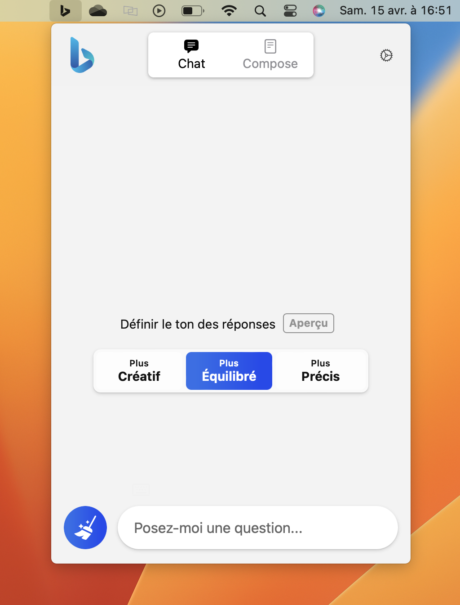
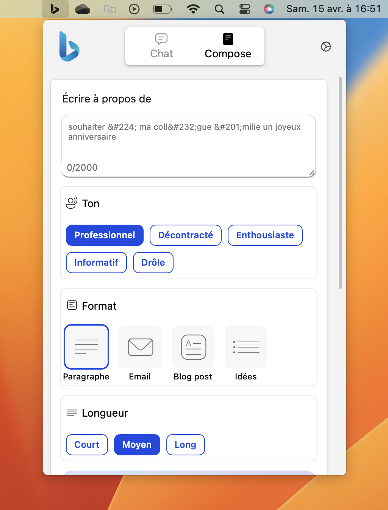

  

<h3 align="center">Bing Search Menubar</h3>

  Bing Search Menubar is a simple app for macOS that lets you quickly access <a href="hhttps://www.bing.com">Bing Search</a> from your menu bar. With just a click, you can open Bing Search and start chatting with the powerful language model, Assistant.

# About

## Features

- Chat with Bing Search

- Use compose interface

- Quick access with keyboard shortcut: ⌃ ⌥ B

## Screenshots

  
  

## Installation

Download `bing-search-menubar-[version].zip` from the [latest release](https://github.com/pierrickrouxel/bing-search-menubar/releases/latest) page and unzip it.

## Compatibility

| OS      | macOS   |
| ------- | ------- |
| Version | ≥13.0 ✔ |

## License

Bing Search Menubar is released under the MIT license. [See LICENSE](https://github.com/pierrickrouxel/bing-search-menubar/blob/main/LICENSE.md) for details.
